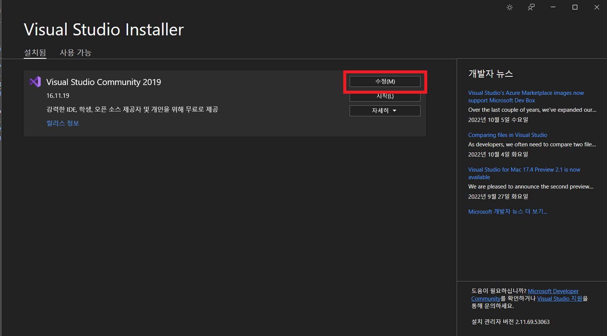

# 언리얼 설치 가이드
1. 다음 링크로 이동해서 에픽게임즈 런처를 다운 받아 설치한다.
- https://store.epicgames.com/en-US/
 
1. 다운로드 중에 에픽게임즈 회원가입을 한다.
2. 설치가 되었으면 런처를 실행해서 아까 가입한 정보로 로그인한다.
3. 왼쪽 목차에 보면 언리얼엔진이라고 적혀져 있다. 클릭하자.
4. 4.27.2버전을 선택하고 설치를 누른다.
 
5. 우리는 C++로 게임을 만들고 싶어하기 때문에 Visual Studio 2019를 다운받자. 그 이전에 회원가입을 해야한다. 그리고 Visual Studio Dev Essentials를 구독하라고 하는데 공짜이고 구독하자. 그래야 사용할 수 있다.
- https://visualstudio.microsoft.com/vs/older-downloads/
 
 
6. 다운로드하고 설치하자.
- 
7.  친절하게 어떻게 설정해야 하는지 공식문서에 나와 있다.
- https://docs.unrealengine.com/4.27/en-US/ProductionPipelines/DevelopmentSetup/VisualStudioSetup/
8. 자알 따라가서 세팅하자!

vs 영어 설정법
1. Visual Studio Installer를 실행한다.
2. Visual Studio 2019 수정하기 버튼 클릭
  
3. 언어팩 항목에서 영어만 클릭하고 설치
  